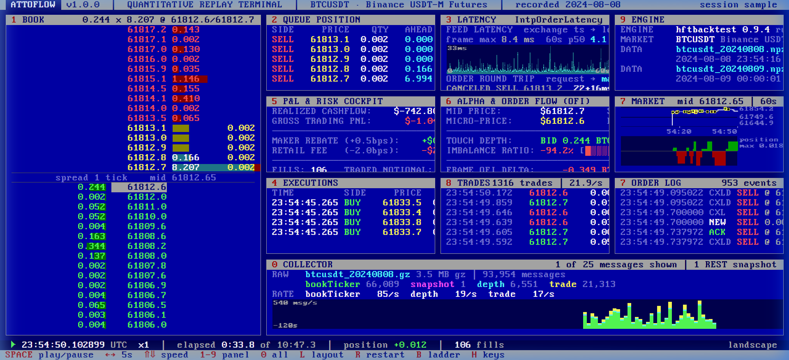

# AttoFlow — High-Frequency Execution Engine & Microstructure Replay Terminal

[](cpp_core/)
[](runner/)
[](dashboard/)
[](LICENSE)
[](cpp_core/)

**AttoFlow** is a deterministic, event-driven High-Frequency Trading (HFT) simulation platform and quantitative market-microstructure replay terminal. Engineered for extreme fidelity, AttoFlow models exchange matching engine dynamics down to sub-microsecond precision: **Price-Time (FIFO) queue position priority**, packet flight latency, post-only (GTX) order rejections, adverse selection, and tick-by-tick orderbook reconstruction.

The architecture combines a **cache-aligned, zero-allocation C++20 Limit Order Book core**, a **high-throughput Rust simulation runner** (>6,000,000 events/sec), and a **retro IBM VGA text-mode financial terminal UI** featuring real-time P&L risk accounting, micro-price fair value models, and Order Flow Imbalance (OFI) signal alpha.

---

## 📸 Replay Terminal Cockpit



> **Terminal Interface**: IBM VGA 9x16 bitmap font, CGA/EGA 16-color palette, rendering 10 real-time quantitative panels (Level-2 Orderbook Ladder, Queue Position, Order Round-Trip Latency, Microsecond Trades, P&L Risk Engine, and Alpha Signals).

---

## ⚡ Key Highlights & Core Capabilities

| Feature | Description | Engineering Implementation |
| :--- | :--- | :--- |
| **C++20 LOB Core** | Zero heap allocation in hot path, $O(1)$ insertions and cancellations. | Cache-line aligned (`alignas(64)`), doubly-linked price level buckets. |
| **Rust Event Engine** | Replays real tick sessions at **6.14M events/sec**. | SIMD-assisted binary `.hbr` parsing, non-blocking lock-free event loop. |
| **Realistic Queue Modeling** | Models exact position ahead of your order in the orderbook queue. | Probabilistic Price-Time priority models (`PowerProbQueueModel3`). |
| **Flight Latency & Adverse Selection** | Simulates exchange packet flight times ($2\text{--}200\text{ ms}$). | Post-only (GTX) order rejection handling & queue join delays. |
| **Order Flow Alpha (OFI)** | Real-time microstructural imbalance & micro-price signals. | Cont-Kukanov-Stoikov Order Flow Imbalance vector calculation. |
| **Retro Terminal UI** | Bloomberg-style 10-panel cockpit built with Vite & TypeScript. | Pure CSS grid layout, 1-character grid alignment, zero canvas overhead. |

---

## 🏗️ System Architecture

```text
┌──────────────────────────────────────────────────────────────────────────────────┐
│                             MARKET DATA PIPELINE                                 │
│  [Binance USDT-M Futures] ──WebSocket──> [tools/collect.py] ──> [.hbr Recording] │
└────────────────────────────────────────┬─────────────────────────────────────────┘
                                         │
                                         ▼
┌──────────────────────────────────────────────────────────────────────────────────┐
│                         HIGH-PERFORMANCE RUNNER (RUST)                           │
│  - Binary .hbr Decoder & Event Dispatcher (6.14M events/sec)                     │
│  - Strategy Engine: Grid Market Maker (Avellaneda-Stoikov Inventory Skew)        │
│  - Realistic FIFO Queue Depth & Latency Emulator                                 │
└────────────────────────────────────────┬─────────────────────────────────────────┘
                                         │
                                         ▼
┌──────────────────────────────────────────────────────────────────────────────────┐
│                         MATCHING ENGINE CORE (C++20)                             │
│  - Zero-Allocation Limit Order Book (LOB)                                        │
│  - Sub-500ns Order Insertion & Sub-280ns Order Cancellation                     │
│  - Crossing Depth Sweeper & Price Level Bucketing                                │
└────────────────────────────────────────┬─────────────────────────────────────────┘
                                         │
                                         ▼
┌──────────────────────────────────────────────────────────────────────────────────┐
│                      REPLAY TERMINAL COCKPIT (DASHBOARD)                         │
│  - Retro IBM VGA 9x16 Bitmap Console (10 Synchronized Real-Time Panels)         │
│  - Real-Time Risk & P&L Cockpit, Latency Sparklines, Trade Tape, OFI Gauges     │
└──────────────────────────────────────────────────────────────────────────────────┘
```

---

## 🎯 Why Traditional Backtesters Fail in HFT

Standard quantitative backtesters evaluate strategies using 1-second or 1-minute OHLCV candles. In high-frequency market making, this creates severe simulation bias:

1. **Queue Priority (FIFO / Price-Time)**: Placing an order at the touch (best bid) does not guarantee execution when a market order hits that price. Your order sits behind resting volume; the market must trade through **every unit ahead of you** before your order receives execution.
2. **Flight Latency & Adverse Selection**: Transmission over the WAN introduces latency. If the market moves while your limit order is in flight, **post-only orders (GTX) get rejected**, leaving you unhedged during violent price moves.
3. **Micro-Economics**: BTC quotes at the touch operate on a tight 1-tick spread ($0.013\text{ bps}$). Profitability requires exact accounting for maker rebates ($+0.005\%$) versus retail taker fees ($-0.02\%$).

---

## 🚀 C++20 Core Benchmark Results

Benchmarked on x86-64 Linux/Windows (`-O3 -std=c++20`):

```text
====================================================
   ATTOFLOW HFT ENGINE - LOB BENCHMARK (C++20)     
   Author: Harshwardhan Bhaskar                      
====================================================

[1] Benchmarking Resting Order Insertions (500,000 orders)...
    -> Total time:   240.1 ms
    -> Throughput:   2,082,421 orders/sec
    -> Avg Latency:  480.2 ns / order

[2] Benchmarking Order Cancellations (100,000 orders)...
    -> Total time:   27.8 ms
    -> Throughput:   3,597,329 cancels/sec
    -> Avg Latency:  278.0 ns / cancel

[3] Benchmarking Aggressive Market Matching (Crossing Depth)...
    -> Matched 50.0 BTC across 59 price levels in 80.40 us
```

---

## 📊 Terminal Cockpit Panels

The replay terminal renders 10 synchronized real-time quantitative monitoring modules:

| Panel | Module Name | Features & Indicators |
| :---: | :--- | :--- |
| **`1`** | **Level-2 Book Ladder** | 46-column orderbook ladder, resting bids/asks, active queue position markers, trade flash overlays. |
| **`2`** | **Queue Position** | Live volume ahead of active orders, fill probability, cancellation status. |
| **`3`** | **Latency Monitor** | Real-time sparkline graph of feed packet latency & order round-trip time (RTT). |
| **`4`** | **Executions** | Fill tape with time-at-touch before fill and rested duration. |
| **`5`** | **P&L & Risk Cockpit** | Real-time cashflow accounting, mark-to-market unrealized P&L, maker rebate vs fee breakdown, ASCII equity curve (` ▂▃▅▆▇█`). |
| **`6`** | **Alpha & OFI** | Cont-Kukanov-Stoikov Order Flow Imbalance, micro-price divergence, volume ratio pressure gauges (`[████████░░░░]`). |
| **`7`** | **Market** | 60-second rolling mid-price chart & cumulative inventory position graph. |
| **`8`** | **Trades** | Microsecond public trade feed with buyer/seller initiation breakdown. |
| **`9`** | **Engine Status** | Replay telemetry showing processing rates exceeding **6,140,000 events/sec**. |
| **`0`** | **Collector** | Live WebSocket connection stats, message throughput graph, packet jitter warnings. |

---

## 📐 Mathematical Models

### 1. Book Pressure (Micro-Price Fair Value)
$$P_{\text{micro}} = \frac{P_{\text{bid}} \cdot Q_{\text{ask}} + P_{\text{ask}} \cdot Q_{\text{bid}}}{Q_{\text{bid}} + Q_{\text{ask}}}$$

### 2. Order Flow Imbalance (OFI)
$$\text{OFI}_t = I_{\{P_{b,t} \ge P_{b,t-1}\}} Q_{b,t} - I_{\{P_{b,t} \le P_{b,t-1}\}} Q_{b,t-1} - I_{\{P_{a,t} \le P_{a,t-1}\}} Q_{a,t} + I_{\{P_{a,t} \ge P_{a,t-1}\}} Q_{a,t-1}$$

### 3. Inventory Skew (Avellaneda-Stoikov variant)
$$\delta_{\text{skew}} = -\gamma \cdot q$$

---

## 🛠️ Quick Start Guide

### 1. Compile & Run C++20 Core Benchmark
```bash
cd cpp_core
g++ -std=c++20 -O3 -Iinclude src/orderbook.cpp benchmark/benchmark_lob.cpp -o benchmark_lob
./benchmark_lob
```

### 2. Run Rust Event Runner
```bash
cd runner
cargo run --release
```

### 3. Launch Replay Terminal UI
```bash
cd dashboard
npm install
npm run dev
```
Open **`http://127.0.0.1:5180/?session=sample`** in your browser.

---

## 📡 Live Market WebSocket Streaming

AttoFlow supports real-time live streaming directly from Binance USDT-M Futures (`wss://fstream.binance.com`).

### Start Live Server:
```bash
python tools/live_server.py --symbol btcusdt --port 8765
```
Open **`http://127.0.0.1:5180/?mode=live`** to view real-time live tick data, micro-price movements, and live Order Flow Imbalance (OFI) in the terminal UI.

---

## ⌨️ Terminal Navigation Hotkeys

| Key | Action |
| :---: | :--- |
| `SPACE` | Play / Pause simulation replay |
| `←` / `→` | Seek backward / forward 5 seconds (`Shift + Arrow` for 30s) |
| `↑` / `↓` | Double / half playback speed |
| `1` – `9` | Fullscreen zoom into specific panel |
| `0` | Return to 10-panel cockpit grid |
| `L` | Toggle between Landscape (desktop) and Portrait (mobile 9:16) layout |
| `B` | Toggle order book ladder mode (active levels vs every tick) |
| `R` | Restart replay from beginning |

---

## 👨‍💻 Author & License

Designed & Developed by **Harshwardhan Bhaskar**  
GitHub: [@HarshwardhanBhaskar](https://github.com/HarshwardhanBhaskar/attoflow-hft)  
Repository: [attoflow-hft](https://github.com/HarshwardhanBhaskar/attoflow-hft)  
License: **MIT License**
